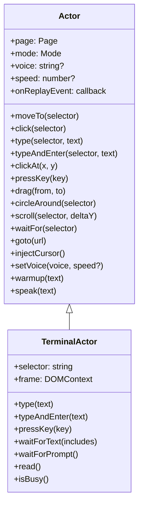
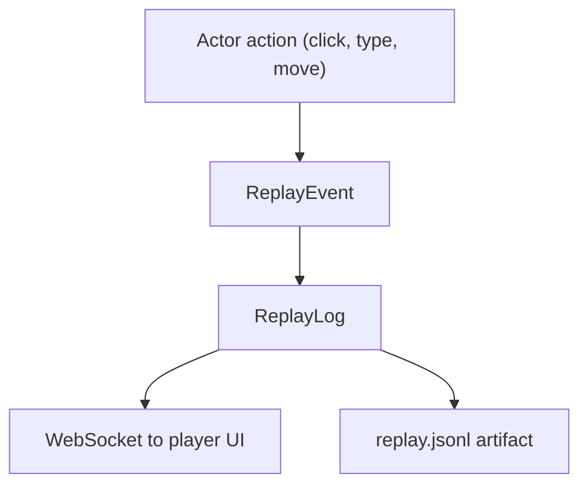
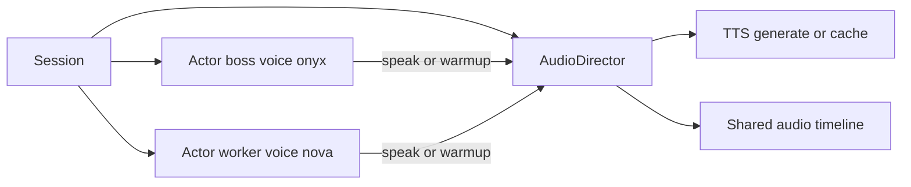
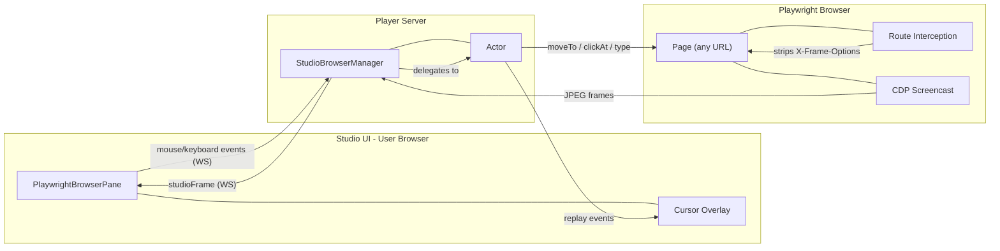

# Actor Architecture

The `Actor` class is the primary API for interacting with browser and terminal panes in browser2video. Every pane (browser window, terminal, studio browser) is controlled through an Actor instance.

## Actor Hierarchy



## How Actors Are Created

Actors are always created by the `Session` class. Each Actor is attached to a Playwright `Page` and wired to the session's `ReplayLog` for event streaming.

```mermaid
sequenceDiagram
    participant Scenario
    participant Session
    participant Actor
    participant ReplayLog

    Scenario->>Session: openPage(url)
    Session->>Session: browser.newContext()
    Session->>Session: context.newPage()
    Session->>Actor: new Actor(page, mode)
    Session->>Actor: setSessionStartTime(t)
    Session->>Actor: setAudioDirector(audioDirector)
    Session->>Actor: onReplayEvent = replayLog.emit
    Session-->>Scenario: { page, actor }

    Scenario->>Actor: actor.click("#button")
    Actor->>Actor: moveCursorTo(x, y)
    Actor->>ReplayLog: emit(cursorMove)
    Actor->>Actor: page.mouse.click(x, y)
    Actor->>ReplayLog: emit(click)
```

## Replay Events

Every Actor interaction in `human` mode emits replay events. These events drive:
- Live cursor overlay in the player UI
- Recorded `replay.jsonl` for playback



Event types:

| Type | Fields | Emitted by |
|------|--------|------------|
| `cursorMove` | `x, y, ts` | `moveTo`, `circleAround`, `drag`, `draw` |
| `click` | `x, y, ts` | `click`, `clickAt`, `selectOption` |
| `keyPress` | `key, ts` | `pressKey` |
| `stepStart` | `index, caption, ts` | `session.step()` |
| `stepEnd` | `index, ts` | `session.step()` |
| `audio` | `label, durationMs, ts` | `actor.speak()` or `session.step(..., narration, ...)` |

## Per-Actor Narration And Voice

Each actor can now own voice defaults:

- `actor.setVoice("onyx")` sets the actor's default TTS voice.
- `actor.setVoice("nova", 1.15)` sets both voice and speech speed.
- `actor.warmup(text)` pre-generates audio using that actor's defaults.
- `actor.speak(text)` narrates using the actor's defaults.

Session still owns one shared `AudioDirector` (cache/mixing/timeline), and injects it into every actor when the actor is created. That gives you per-actor voice behavior without duplicating audio pipelines.



## Studio Browser Panes (Playwright-backed)

In the studio UI, browser panes are backed by real Playwright pages. This bypasses `X-Frame-Options` / CSP restrictions that block iframe embedding (e.g. `github.com`). The page is opened as a top-level Playwright page, and its visual output is streamed to the studio UI via CDP screencast.



### Interactive flow

User interactions in the studio pane are forwarded through the Actor:

```mermaid
sequenceDiagram
    participant User as Studio UI
    participant WS as WebSocket
    participant SBM as StudioBrowserManager
    participant Actor
    participant Page as Playwright Page

    User->>WS: studioMouseEvent(move, x, y)
    WS->>SBM: forwardMouseEvent(paneId, event)
    SBM->>Actor: actor.moveTo(x, y)
    Actor->>Page: page.mouse.move(x, y)
    Actor-->>WS: replayEvent(cursorMove)
    Page-->>SBM: CDP screencastFrame
    SBM-->>WS: studioFrame(base64)
    WS-->>User: render frame + cursor overlay

    User->>WS: studioMouseEvent(click, x, y)
    WS->>SBM: forwardMouseEvent(paneId, event)
    SBM->>Actor: actor.clickAt(x, y)
    Actor->>Page: page.mouse.click(x, y)
    Actor-->>WS: replayEvent(click)
    Page-->>SBM: CDP screencastFrame (updated)
    SBM-->>WS: studioFrame(base64)
    WS-->>User: render updated frame + click effect
```

### Scenario automation

Scenarios can also interact with studio browser panes programmatically using the same Actor API:

```typescript
const actor = studioBrowserManager.getActor("pane-1");

// Actor methods — same API as scenario recordings
await actor.click("#login-button");
await actor.type("#email", "user@example.com");
await actor.circleAround(".important-element");

// Direct Playwright Page access via actor.page
await actor.page.evaluate(() => document.title);
await expect(actor.page.locator(".result")).toContainText("Success");
```

Both paths (user interaction and scenario automation) produce identical replay events and CDP screencast frames — the user sees everything live in the studio pane.
